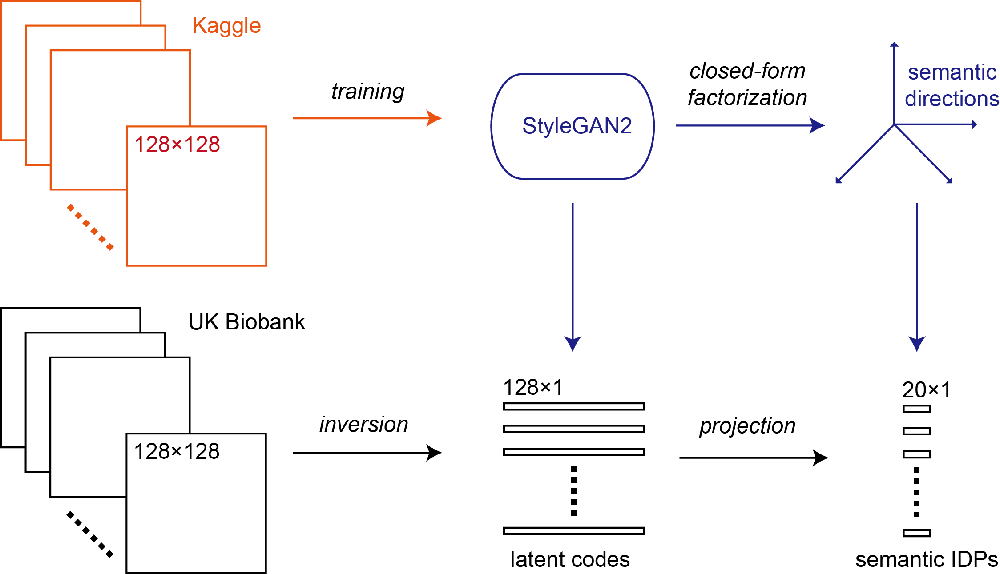

# semanticIDP
A StyleGAN2-based method to create semantic image-derived phenotypes (IDPs).

## Prerequisite
This method uses the StyleGAN2 PyTorch implementation at (https://github.com/rosinality/stylegan2-pytorch). Please install it and refer to its usage before using the script in this repository.
## Usage
Please run the following steps in turn:
* Prepare data (Prepare.py at [rosinality/stylegan2-pytorch](https://github.com/rosinality/stylegan2-pytorch))
* Train model (train.py at [rosinality/stylegan2-pytorch](https://github.com/rosinality/stylegan2-pytorch))
* Invert target images (projector.py at [rosinality/stylegan2-pytorch](https://github.com/rosinality/stylegan2-pytorch))
* Closed-form factorization (closed_form_factorization.py at [rosinality/stylegan2-pytorch](https://github.com/rosinality/stylegan2-pytorch))
* Create semantic IDPs (get_coordinate.py in this repository)
## Example
Here I provide sample intermediate result files (in folder **sample**) to demonstrate the last step to create semantic IDPs.
Folder **sample/inversion_results** contains the sample output results of the third step, inversion of target images.
File **sample/factor.pt** is the sample output result of the four step, closed-form factorization.
Then run:
> python get_coordinate.py --factor sample/factor.pt --projection_dir sample/inversion_results
In the output file, the semantic IDPs are ordered by their relative importance (singular values). Select appropriate number of IDPs for GWAS by yourself!
## References
StyleGAN2 [[Paper](https://arxiv.org/abs/1912.04958)][[Github](https://github.com/NVlabs/stylegan2)]
Closd-form factorization [[Paper](https://arxiv.org/abs/2007.06600)][[Github](https://github.com/genforce/sefa)]